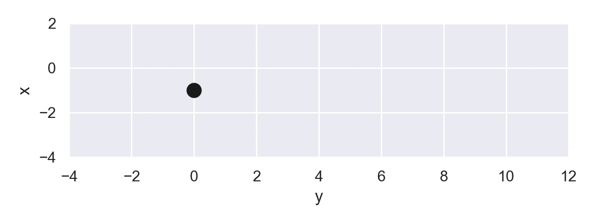

## テスト粒子計算モジュール（sim.testparticle）の使い方

### 1. 概要
定常電磁場中のプラズマについて、運動方程式を解きながらその粒子軌道を描画することを目的とした簡易モジュールを作ってみました。プラズマのジャイロ運動を元にした各種ドリフトを確認するというプラズマ初学者向けの教材として、あるいは特定の宇宙プラズマ環境下の研究において粒子軌道を追跡してみるといった補助的なツールとして利用されることを想定しています。必要最小限な環境のみ作ってますので、容易にカスタマイズして利用していただけると思います。


### 2. 計算
中身は極めて単純です。初期値として位置 $\mathbf{r}_0$、速度 $\mathbf{v}_0$を与え、差分化した以下の運動方程式を時間更新していくだけです。相対論的粒子への拡張もしてません。

$$ \frac{d\mathbf{r}}{dt}=\mathbf{v},\quad \frac{d\mathbf{v}}{dt}=\frac{q}{m}\left(\mathbf{E}+\mathbf{v}\times\mathbf{B}\right) $$

微分方程式の解法としては4次のRunge-Kutta法を用いていますが、ユーザーが好きな手法で編集することも自由です。


### 3. 構成
ディレクトリ`sim`以下、計算のメインパート（`testp.py`）、電磁場プロファイルの設定（`field.py`）、運動方程式関連（`engine.py`）、図作成関連（`plot.py`）とそれぞれ役割を分担させたpythonファイルで構成されています。

***
`testp.py`

計算用クラス（`testparticle`）のインスタンスを作成し、メソッド`run`で計算を実行します。計算結果はインスタンス変数`r`（位置）、`v`（速度）に格納され、以降の描画などで使われます。

***
`field.py`

計算で用いる電磁場プロファイルを定義します。関数`emfld`は位置座標`r`（要素数3のndarray）とプロファイルの種類を指定する変数`type`を引数として、磁場`mf`、電場`ef`（それぞれ要素数3のndarray）を返します。

`type`としてはこのver 1.では計算サンプルとして、0. 一様磁場中の単なるジャイロ運動、1. $E\times B$ドリフト、2. 磁場勾配ドリフトを設けています。ソースを見れば説明不要と思いますが、(bx, by, bz)が磁場3成分、(ex, ey, ez)が電場3成分です。数値を適当に編集したりもしてみてください。

`type=3`に、計算に使うプロファイルをユーザー各自が定義してください。座標値はx→`r[0]`、y→`r[1]`、z→`r[2]`で表されています。

***
`engine.py`

運動方程式`eqm`とRunge-Kutta法`RungeKutta`があります。ここは特に編集する必要はないと思います。

***
`plot.py`

計算結果をmatplotlibを用いて図にする作業を簡便化するためのメソッドをまとめています。現時点で用意しているのは、

* `traceplot`：2次元平面内の粒子軌道を動画としてトレースする
* `orbplot`：2次元平面内の粒子軌道を描く
* `traceplot3d`：3次元平面内の粒子軌道を動画としてトレースする
* `orbplot3d`：3次元平面内の粒子軌道を描く
* `energycheck`：初期値からの粒子の運動エネルギーの変動（あるいは）を示す

の5つです。


### 4. 使い方
```python
import numpy as np
import matplotlib.pyplot as plt
```
が最初になされていることを前提に進めます。あとipython上での実行も前提としています。

#### 4.1 インスタンスの作成
```python
from sim import plot, testp
data = testp.testparticle()
```

として計算用のインスタンス（ここでは`data`）を最初に作成します。引数には

* `dt`：差分における時間ステップ
* `itmax`：総計算ループ数
* `r0`：初期位置`r0`
* `v0`：初期速度`v0`
* `type`：使用する電磁場プロファイルの選択
* `charge`：粒子の電荷
* `mass`：粒子の質量

があり、そのうち電荷と質量はデフォルトで1が指定されています（規格化はとりあえず適当）。他の引数は指定されていない場合はインスタンス作成時に入力を促されます。`r0`と`v0`についてはx, y, zの3成分を入力します。

引数指定例：

```python
data = testp.testparticle(dt=0.001, itmax=5000, r0=[1.0, 0.0, 0.0], v0=[0.0, 1.0, 0.0], type=1)
```

これらはすべて`data.dt`...で参照され、後から編集して別の計算を行うこともできます。

#### 4.2 計算実行
インスタンス`data`に必要な初期値を設定したら

```python
data.run()
```
で計算を実行します。本プログラムでは`tqdm`パッケージを利用して計算経過をゲージ表示させていますが、これが鬱陶しい方（あるいは`tqdm`を入れていない方）は`testp.py`内の`run`にある`trange`を`range`に変えていただければ結構です。

計算結果（位置、速度）はそれぞれ`data.r, data.v`で参照できます。要素へのアクセスは、例えば10ステップ目のy座標であれば`data[10,1]`となります。各ステップ毎の時間は`data.time`に格納されます。

また`run`においてデフォルトでは引数`mode='show'`となっていますが、これは計算終了後にそのまま`orbplot`によってxy面内の粒子軌道図の描画も行います。`mode='trace'`なら`traceplot`が実行され、Noneなら図の表示は省略されます。

#### 4.3 図の作成
計算終了後の`data`インスタンスに格納されたデータを用いて行います。あとは普通にmatplotlibを使ってください。

* 例1：xy面内の粒子軌道

```python
plt.plot(data.r[:,0], data.r[:,1])
```
* 例2：速度のz成分の時間変化

```python
plt.plot(data.time, data.v[:,2])
```

`plot.py`にあるメソッドを使えば若干タイピングが楽になります（単に自分が楽したいから作っただけ）。粒子軌道については、例えばxy面内であれば

```python
plot.orbplot(data, display=12)
```
でも描くことができます。引数の`display`で平面を指定しますが、x:1, y:2, z:3に対応していて`display=23`とすればyz面内の軌道になります（`traceplot`も同様）。いずれも

```python
plot.traceplot?
```
などで詳しく説明してあります。

#### 4.4 図の例

磁場勾配ドリフト



### 5. 雑記
* そもそもの目的はもう少し本格的なシミュレーション用のモジュール作成ですが、取急ぎ大まかなインターフェースを作っておこうと思い、手っ取り早くテスト粒子計算で正常に計算ができるか確かめてみたという次第です。
* 現在計算機センターのスパコン更新作業中で、おそらく年内いっぱいアクセスできないので、それまでの埋め合わせになるようなプログラムを作ってみたいという状況です。
* クラスやら何やら、ネットで勉強したお作法を使ってみたい、自称永遠のpython初心者です。
* `orbplot`などで`data`を引数にしているのはクールじゃないとは思いますが、プロット部を本体から分離させたかったのでとりあえず現在の書き方ににとどめています（継承とか使えばいいのかな）。
* 粒子軌道のトレースについてはもっとスマートな方法もあるのでしょうが、まずは動けばいいという妥協。
* ~~粒子軌道のトレース動画をファイルとして保存するのはまた今度~~
* ~~mplot3dを使って、軌道を3次元空間内に描くこともまた今度。~~
* 今は粒子1個の計算ですが、何個くらいまでの計算が実用的かな（そもそもそんな計算にpythonを使うなという話が…）
* 計算データをHDFファイルに書き出してもいいのですが、pythonなのでpickle化でもいいのかな。
* Speiser軌道を描いたり、ポアンカレマップを作ったりするところまでは使えますかね。
* 要は運動方程式を解くだけなので、`engine.py`の`eqm`のところを修正すれば（例えば重力にするとか）大学1年生向け力学の授業で使う資料作成にも便利かも。
* もちろん、質問やバグ報告など大歓迎です。

ということで、個人で使うだけの（それもお粗末な）ツールを公開するのもお為ごかしに過ぎませんが、このプラズマの「おもちゃ」で適当に遊んでいただけたら幸いです。
